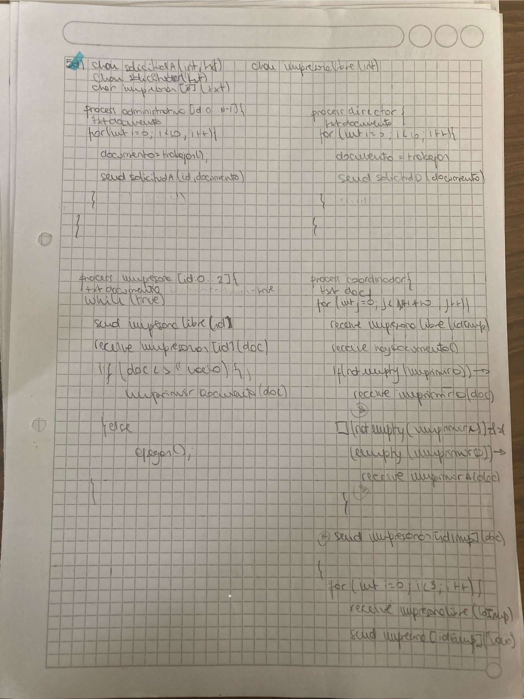

# Práctica 4 – Pasaje de Mensajes
# Asincrónico

## Ejercicio 1

**Enunciado:**  
Suponga que N clientes llegan a la cola de un banco y que serán atendidos por sus empleados. Analice el problema y defina qué procesos, recursos y canales/comunicaciones serán necesarios/convenientes para resolverlo. Luego, resuelva considerando las siguientes situaciones:

a. Existe un único empleado, el cual atiende por orden de llegada.

b. Ídem a) pero considerando que hay 2 empleados para atender, ¿qué debe modificarse en la solución anterior?

c. Ídem b) pero considerando que, si no hay clientes para atender, los empleados realizan tareas administrativas durante 15 minutos. ¿Se puede resolver sin usar procesos adicionales? ¿Qué consecuencias implicaría?
 
### Respuestas:
a)
```

chan cola(int);

Process Persona [id: 0..N-1] {
	send cola(id);
}

Process Empleado {
	int id;
	for int i: 0 .. N-1 {
        receive cola(id);
        AtenderCliente(id);
    }
}
```

b)
```
chan cola(int);

Process Persona [id: 0..N-1] {
	send cola(id);
}

Process Empleado [id: 0..1] {//esto es lo que modifica respecto de a
	int id;
	while (true) {
        receive cola(id);
        AtenderCliente(id);
    }
}
```

c)
```
chan Atenciones(int);
chan Pedido(int);
chan Siguiente[2](int);

Process Coordinador {
	int idCliente;
	int idE;
	int cantClientes = 0;
	while (cantClientes < N) {
        receive Pedido(idE); //se demora esperando la solicitud del emp
        if (empty(Atenciones)) idCliente = -1; //si el canal del cliente está vacío le mando el id "vacío"
        else {
            receive Atenciones (idCliente); //sino recibo el id del cliente para luego mandarlo al e,pleado que consultó
            cantClientes++;
        }
	    send Siguiente[idE] (idCliente);
    }
    for int i: 0..1 {
        send Siguiente[i] (-999); 
    }
}

Process Empleado [id: 0..1] {
	int idCliente;
	boolean seguir = true;
	while (seguir) {
        send Pedido(id); //pido el siguiente y le paso mi id
        receive Siguiente[id](idCliente); //se demora esperando recibir el siguiente
        if (idCliente = -999) {
            seguir = false;
        } else {
            if (idCliente = -1) {
                delay (900);
               //realiza tareas administrativas
            } else {
                AtenderCliente(idCliente);
            }
        }
    }
}

Proces Persona [id: 0..N-1] {
	send Atenciones(id);
}

// Se puede resolver poniendo un canal atención para cada empleado, lo cual obligaría a que el cliente solicite atención a UN empleado en particular (QUE NO ES LO PEDIDO!)
```

## Ejercicio 2

**Enunciado:**  
Se desea modelar el funcionamiento de un banco en el cual existen 5 cajas para realizar pagos. Existen P clientes que desean hacer un pago. Para esto, cada una selecciona la caja donde hay menos personas esperando; una vez seleccionada, espera a ser atendido. En cada caja, los clientes son atendidos por orden de llegada por los cajeros. Luego del pago, se les entrega un comprobante. Nota: maximizar la concurrencia.
 
### Respuestas:
```
chan pedirCaja(int);
chan liberarCaja(int);
chan hayPedido(boolean);
chan esperaCaja[P](int);
chan esperaComprobante[P](text);
chan hayAtencion[5](int, text);

Process Cliente [id: 0..P-1] {
	text pago, comprobante;
	int nroCaja;
	send pedirCaja(id);
	send hayPedido(true);
	receive esperaCaja[id](nroCaja);
	send hayAtencion[nroCaja](id, pago);
	receive esperaComprobante[id](comprobante);
	send liberarCaja(nroCaja);
	send hayPedido(true);
}

Process Administrador {
	int vecContador [5] = ([5], 0);
	int idCliente, nroCaja, cajaMin;
	boolean pedido;
	while (true) {
		receive hayPedido(pedido);
        if (not empty (liberarCaja)) → 	
			receive liberar(nroCaja);
            vecContador[nroCaja]--;
		[] (not empty(pedirCaja) & empty(liberarCaja)) → 
			receive pedirCaja(idCliente);
            cajaMin = min (vecContador);
            vecContador[cajaMin]++;
            send esperarCaja[idCliente](cajaMin);
    }
}

Process Caja [id: 0..4] {
	ind idCliente;
	text pago, comprobante;
	while (true) {
        receive hayAtencion[id](idCliente, pago);
        comprobante = GenerarComprobante(pago);
        send esperaComprobante[idCliente] (comprobante);
    }
}
```
## Ejercicio 3

**Enunciado:**  

 Se debe modelar el funcionamiento de una casa de comida rápida, en la cual trabajan 2 cocineros y 3 vendedores, y que debe atender a C clientes. El modelado debe considerar que:

Cada cliente realiza un pedido y luego espera a que se lo entreguen.
Los pedidos que hacen los clientes son tomados por cualquiera de los vendedores y se lo pasan a los cocineros para que realicen el plato. Cuando no hay pedidos para atender, los vendedores aprovechan para reponer un pack de bebidas de la heladera (tardan entre 1 y 3 minutos para hacer esto).
Repetidamente cada cocinero toma un pedido pendiente dejado por los vendedores, lo cocina y se lo entrega directamente al cliente correspondiente. Nota: maximizar la concurrencia.
### Respuestas:

```
chan pedidoComida(int, text);
chan pedidoPorHacer(int, text);
chan hayPedido(int);
chan siguiente[2](int, text);
chan esperaEntrega[C](text);

Process Cliente [id: 0..C-1] {
	text plato;
	text pedido = …;
	send pedidoComida(id, pedido);
	receive comidita[id] (plato);
}

Process Coordinador {
	text pedido;
	int idVendedor, idCliente;
	while (true) {
        receive hayPedido(idVendedor);
        if empty (pedidoComida) {
            idCliente = -1;
            pedido = “VACIO”;
        } else {
            receive pedidoComida(idCliente, pedido);
        }
        send siguiente[idVendedor] (idCliente, pedido);
    }
}

Process Vendedor [id: 0..1] {
	text pedido;
	int idCliente;
	while (true) {
        send hayPedido(id);
        receive siguiente[id] (idCliente, pedido);
        if (idCliente = -1) {
            reponer();
        } else {
            send comanda(idCliente, pedido);
        }
    }
}

Process Cocinero [id: 0..2] {
	text pedido, plato;
	int idCliente;
	while (true) {
        receive comanda(idCliente, pedido);
        plato = CocinarPlato(pedido);
        send comidita[idCliente](plato);
    }
}
```

## Ejercicio 4

**Enunciado:**  
Simular la atención en un locutorio con 10 cabinas telefónicas, el cual tiene un empleado que se encarga de atender a N clientes. Al llegar, cada cliente espera hasta que el empleado le indique a qué cabina ir, la usa y luego se dirige al empleado para pagarle. El empleado atiende a los clientes en el orden en que hacen los pedidos. A cada cliente se le entrega un ticket factura por la operación.

a. Implemente una solución para el problema descrito.

b. Modifique la solución implementada para que el empleado dé prioridad a los que terminaron de usar la cabina sobre los que están esperando para usarla.

Nota: maximizar la concurrencia; suponga que hay una función Cobrar() llamada por el empleado que simula que el empleado le cobra al cliente.
 
### Respuestas: Este lo tengo bien corregido en papel

a) //podría usar cola para cabinas libres tiró el profe 
```
chan solicitarCabina(int);
chan esperarCabina[N](int);
chan pagar(int, int);
chan esperarTicket[N](text);
chan hayPedido(boolean);

Process Cliente [id: 0..N-1] {
	int cabina;
	text ticket;
	send solicitarCabina(id);
	send hayPedido(true);
	receive esperarCabina[id](cabina);
	UsarCabina[cabina];
	send pagar(id, cabina);
	send hayPedido(true);
	receive esperarTicket[id](ticket);
}

Process Empleado {
	boolean cabinasOcupadas[10] = ([10], false);
	int cabina, idCliente;
	boolean ok;
	while (true) {
		receive hayPedido(ok);
		if (not empty(pagar)) → 
            receive pagar(idCliente, cabina);
            cabinasOcupadas[cabina] = false;
            text ticket = Cobrar(idCliente);
            send esperarTicket[idCliente](ticket);	
        [] (not empty(solicitarCabina)) →
	        if (not HayCabinasLibres(cabinasOcupadas)) {
                receive pagar(idCliente, cabina);
                cabinasOcupadas[cabina] = false;
                text ticket = Cobrar(idCliente);
                send esperarTicket[idCliente](ticket);	
            }
            receive solicitarCabina(idCliente);
            cabina = BuscarCabinaLibre(cabinasOcupadas);
            cabinasOcupadas[cabina] = true;
            send esperarCabina[idCliente](cabina);
	    fi
    }
}
```
b)
```
chan solicitarCabina(int);
chan esperarCabina[N](int);
chan pagar(int, int);
chan esperarTicket[N](text);
chan hayPedido(boolean);

Process Cliente [id: 0..N-1] {
	int cabina;
	text ticket;
	send solicitarCabina(id);
	send hayPedido(true);
	receive esperarCabina[id](cabina);
	UsarCabina[cabina];
	send pagar(id, cabina);
	send hayPedido(true);
	receive esperarTicket[id](ticket);
}

Process Empleado {
	boolean cabinasOcupadas[10] = ([10], false);
	int cabina, idCliente;
	boolean ok;
	while (true) {
		receive hayPedido(ok);
		if (not empty(pagar)) {
            receive pagar(idCliente, cabina);
            cabinasOcupadas[cabina] = false;
            text ticket = Cobrar(idCliente);
            send esperarTicket[idCliente](ticket);	
        } else {
            if (not empty(solicitarCabina)) {
                if (not HayCabinasLibres(cabinasOcupadas)) {
                    receive pagar(idCliente, cabina);
                    cabinasOcupadas[cabina] = false;
                    text ticket = Cobrar(idCliente);
                    send esperarTicket[idCliente](ticket);	
                }
                receive solicitarCabina(idCliente);
                cabina = BuscarCabinaLibre(cabinasOcupadas);
                cabinasOcupadas[cabina] = true;
                send esperarCabina[idCliente](cabina);	
            }        
        }
    }
}

// Es necesario esperar en el canal hayPedido porque si no, se generaría busy waiting
```

## Ejercicio 5

**Enunciado:**  
Resolver la administración de 3 impresoras de una oficina. Las impresoras son usadas por N administrativos, los cuales están continuamente trabajando y cada tanto envían documentos a imprimir. Cada impresora, cuando está libre, toma un documento y lo imprime, de acuerdo con el orden de llegada.

a. Implemente una solución para el problema descrito.

b. Modifique la solución implementada para que considere la presencia de un director de oficina que también usa las impresoras, el cual tiene prioridad sobre los administrativos.

c. Modifique la solución (a) considerando que cada administrativo imprime 10 trabajos y que todos los procesos deben terminar su ejecución.

d. Modifique la solución (b) considerando que tanto el director como cada administrativo imprimen 10 trabajos y que todos los procesos deben terminar su ejecución.

e. Si la solución al ítem (d) implica realizar Busy Waiting, modifíquela para evitarlo.

Nota: ni los administrativos ni el director deben esperar a que se imprima el documento.


 
### Respuestas:
a) 
```
chan impresion (text);
Process Impresora [id: 0..2] {
	text docImprimir;
	while (true) {
        receive impresion(docImprimir);
        Imprimir(docImprimir);
    }
}

Process Administrativo [id: 0..N-1] {
	while (true) {
        text doc = Trabajar();
        send impresion(doc);
    }
}
```
b)
```

chan impresionDirector(text);
chan impresionAdmin(text);
chan hayDocumento(boolean);

Process coordinador{
	text docImprimir; int idEmp;
	while (true) {
        receive impresoraLibre(idEmp);
        receive hayDocumento();// para evitar busy waiting
   if (not empty (impresionDirector)) {
            receive impresionDirector(docImprimir);
            *
  [](not empty(impresionAdmin)) && (empty (impresionDirector)) → receive impresionAdmin(docImprimir) *

* send impresora[idImp](docImprimir)
process impresora[id:0..2]{
 txt documento
 while(true){
  sendimpresoraLibre(id);
  receive impresoras[id](documento)
  imprimir(documento)
 }
}
Process Administrativo [id: 0..N-1] {
	while (true) {
        text doc = Trabajar();
        send impresionAdmin(doc);
        send hayDocumento();
    }
}

Process Director {
	while (true) {
        text doc = Trabajar();
        send impresionDirector(doc);
        send hayDocumento(true);
    }
}

```
c)
```
chan impresion (text);
chan esperaImpresion (text);
chan hayImpresion (boolean);

Process Impresora [id: 0..2] {
	text docImprimir;
	receive esperaImpresion (docImprimir);
	while (docImprimir != null) {
        Imprimir(docImprimir);
        receive esperaImpresion (docImprimir);
    }
}

Process Administrativo [id: 0..N-1] {
	for int i: 0..9 {
        text doc = Trabajar();
        send impresion(doc);
        send hayImpresion(true);
    }
}

Process Administrador {
	boolean ok;
	text docImprimir;
	for int i: 0..((N*10)-1) {
        receive hayImpresion (ok);
        receive impresion (docImprimir);
        send esperaImpresion (docImprimir);
    }
    for int i: 0..2 {
        send esperaImpresion (null);
    }
}
```
d)


e) La solución no implica Busy Waiting

# Práctica 4 – Pasaje de Mensajes
# Sincrónico

## Ejercicio 1

**Enunciado:**  
Suponga que existe un antivirus distribuido que se compone de R procesos robots Examinadores y 1 proceso Analizador. Los procesos Examinadores están buscando continuamente posibles sitios web infectados; cada vez que encuentran uno avisan la dirección y luego continúan buscando. El proceso Analizador se encarga de hacer todas las pruebas necesarias con cada uno de los sitios encontrados por los robots para determinar si están o no infectados.

a. Analice el problema y defina qué procesos, recursos y comunicaciones serán necesarios/convenientes para resolverlo.

b. Implemente una solución con PMS sin tener en cuenta el orden de los pedidos.

c. Modifique el inciso (b) para que el Analizador resuelva los pedidos en el orden en que se hicieron.
 
### Respuestas:
a) 
* R Examinadores (productores)
* 1 Analizador (consumidor)
* 1 Admin (dependiendo si se requiere orden o no)
* Comunicación: PMS

b)
```
Process Examinador [id: 0..R-1] {
	text sitioWeb;
	while (true) {
        sitioWeb = buscarWebInfectada();
        Analizador!aviso(sitioWeb);
    }
}

Process Analizador {
	text sitioWeb, resultadoEvaluacion;
	while (true) {
        Examinador[*]?aviso(sitioWeb);
        resultadoEvaluacion = EvaluarSitioWeb(sitioWeb);
    }
}
```

c)
```
Process Admin {
	Cola c;
	text sitioWeb;
	do Examinador[*]?aviso(sitioWeb) → c.push(sitioWeb); // recibo de cualquiera y lo pusheo
	[] not c.isEmpty(); Analizador?pedido() → Analizador!aviso(c.pop(sitioWeb));
	od
}

Process Examinador [id: 0..R-1] {
	text sitioWeb;
	while (true) {
        sitioWeb = buscarWebInfectada();
        Admin!aviso(sitioWeb);
    }
}

Process Analizador {
	text sitioWeb, evaluacion;
	while (true) {
        Admin!pedido();
        Admin?aviso(sitioWeb);
        evaluacion = EvaluarSitioWeb(sitioWeb);
    }
}
```
## Ejercicio 2

**Enunciado:**  
En un laboratorio de genética veterinaria hay 3 empleados. El primero de ellos continuamente prepara las muestras de ADN; cada vez que termina, se la envía al segundo empleado y vuelve a su trabajo. El segundo empleado toma cada muestra de ADN preparada, arma el set de análisis que se deben realizar con ella y espera el resultado para archivarlo. Por último, el tercer empleado se encarga de realizar el análisis y devolverle el resultado al segundo empleado.
 
### Respuestas:
```
Process Empleado1 {
	text muestra; 
	while (true) {
		muestra = PrepararMuestra();
		Admin!enviarMuestra(muestra);
    }
}

Process Empleado2 {
	text muestra, set, analisis;
	while (true) {
		Admin!pedido();
		Admin?aviso(muestra);
		set = ArmarSet(muestra);
		Empleado3!enviarSet(set);
		Empleado3?enviarAnalisis(analisis);
		archivar(analisis);
    }
}

Process Empleado3 {
	text set, analisis;
	while (true) {
        Empleado2?enviarSet(set);
        analisis = ArmarAnalisis(set);
        Empleado2!enviarAnalisis(analisis);
    }
}

Process Admin {
	Cola c;
	text muestra;
	do Empleado1?enviarMuestra(muestra) → c.push(sitioWeb);
	[] not c.isEmpty(); Empleado2?pedido() → Empleado2!aviso(c.pop(muestra));
	od
}
```

## Ejercicio 3

**Enunciado:**  
En un examen final hay N alumnos y P profesores. Cada alumno resuelve su examen, lo entrega y espera a que alguno de los profesores lo corrija y le indique la nota. Los profesores corrigen los exámenes respetando el orden en que los alumnos van entregando.

a. Considerando que P=1.

b. Considerando que P>1.

c. Ídem b) pero considerando que los alumnos no comienzan a realizar su examen hasta que todos hayan llegado al aula.

Nota: maximizar la concurrencia; no generar demora innecesaria; todos los procesos deben terminar su ejecución.
 
### Respuestas:
a)
```
Process Alumno [id: 0..N-1] {
	int nota;
	text examen = HacerExamen();
	Admin!entregarExamen(id, examen);
	Profesor?recibirNota(nota);
}

Process Admin {
	text examen;
	int idAlumno;
	do Alumno[*]?entregarExamen(idAlumno, examen) → c.push(idAlumno, examen);
	[] not c.isEmpty(); Profesor?pedido() → Profesor!aviso(c.pop(idAlumno, examen));
	od
}

Process Profesor {
	int idAlumno, nota;
	text examen;
	for int i: 0 .. N-1 {
		Admin!pedido();
		Admin?aviso(idAlumno, examen);
		nota = CorregirExamen(examen);
		Alumno[idAlumno]!recibirNota(nota);
    }
}
```

b)
```
Process Alumno [id: 0..N-1] {
	int nota;
	text examen = HacerExamen();
	Admin!entregarExamen(id, examen);
	Profesor[*]?recibirNota(nota);
}

Process Admin {
	text examen;
	int idAlumno, idProfesor;
	int cantAlumnos = 0;
	do (cantAlumnos < P); Alumno[*]?entregarExamen(idAlumno, examen) → c.push(idAlumno, examen);
	[] (not c.isEmpty()); Profesor[*]?pedido(idProfesor) → Profesor[idProfesor]!aviso(c.pop(idAlumno, examen)); cantAlumnos++;
	od
//aviso de finalizacion a los profes
	for int i: 0..P-1 {
        Profesor[*]?pedido(idProfesor);
        Profesor[idProfesor]!aviso(-1, null);
    }
}

Process Profesor [id: 0..P-1] {
	int idAlumno, nota;
	text examen;
	Admin!pedido(id);
	Admin?aviso(idAlumno, examen);
	while (idAlumno != -1) {
		nota = CorregirExamen(examen);
		Alumno[idAlumno]!recibirNota(nota);
		Admin!pedido(id);
		Admin?aviso(idAlumno, examen);
    }
}
```
c) 
```
Process Alumno [id: 0..N-1] {
	int nota;
	Barrera!llegada();
	Barrera?comenzar();
	text examen = HacerExamen();
	Admin!entregarExamen(id, examen);
	Profesor[*]?recibirNota(nota);
}

Process Admin {
	text examen;
	int idAlumno, idProfesor;
	int cantAlumnos = 0;
	Cola c;
	do cantAlumnos < N; Alumno[*]?entregarExamen(idAlumno, examen) → c.push(idAlumno, examen); 
	[] not c.isEmpty(); Profesor[*]?pedido(idProfesor) → 
        Profesor[idProfesor]!aviso(c.pop()); 
        cantAlumnos++;
	od
	for int i: 0..P-1 {
        Profesor[*]?pedido(idProfesor);
        Profesor[idProfesor]!aviso(-1, null);
    }
}

Process Profesor [id: 0..P-1] {
	int idAlumno, nota;
	text examen;
	Admin!pedido(id);
	Admin?aviso(idAlumno, examen);
	while (idAlumno != -1) {
		nota = CorregirExamen(examen);
		Alumno[idAlumno]!recibirNota(nota);
		Admin!pedido(id);
		Admin?aviso(idAlumno, examen);
    }
}

Process Barrera {
	int i;
	for i: 0 .. P-1 {
        Alumno[*]?llegada();
    }
    for i: 0 .. P-1 {
        Alumno[i]!comenzar();
    }
}
```
## Ejercicio 4

**Enunciado:**  

 En una exposición aeronáutica hay un simulador de vuelo (que debe ser usado con exclusión mutua) y un empleado encargado de administrar su uso. Hay P personas que esperan a que el empleado lo deje acceder al simulador, lo usa por un rato y se retira.

a. Implemente una solución donde el empleado sólo se ocupa de garantizar la exclusión mutua (sin importar el orden).

b. Modifique la solución anterior para que el empleado los deje acceder según el orden de su identificador (hasta que la persona i no lo haya usado, la persona i+1 debe esperar).

c. Modifique la solución a) para que el empleado considere el orden de llegada para dar acceso al simulador.

Nota: cada persona usa sólo una vez el simulador.


### Respuestas:
a)
```
Process Persona[id: 0..P-1] {
	Empleado!llegar(id);
	Empleado?permiso();
	usarSimulador();
	Empleado!salir();
}

Process Empleado {
	int id;
	for int i: 0 .. P-1 {
        Persona[*]?llegar(id);
        Persona[id]!permiso();
        Persona[id]?salir();
    }
}
```
b)
```
Process Persona[id: 0..P-1] {
	Empleado!llegar();
	Empleado?permiso();
	usarSimulador();
	Empleado!salir();
}

Process Empleado {
	for int i: 0 .. P-1 {
        Persona[i]?llegar();
        Persona[i]!permiso();
        Persona[i]?salir();
    }
}
```
c
```
Process Persona[id: 0..P-1] {
	Admin!llegar(id);
	Empleado?permiso();
	usarSimulador();
	Empleado!salir();
}

Process Admin {
	int idPersona;
	int cantidad = 0;
	do (cantidad < P); Persona[*]?llegar(idPersona) → c.push(idPersona);
	[] not c.isEmpty(); Empleado?pedido() → 
        Empleado!aviso(c.pop(idPersona)); 
        cantidad++;
	od
}

Process Empleado {
	int id;
	for int i: 0 .. P-1 {
        Admin!pedido();
        Admin?aviso(id);
        Persona[id]!permiso();
        Persona[id]?salir();
    }
}
```

## Ejercicio 5

**Enunciado:**  
En un estadio de fútbol hay una máquina expendedora de gaseosas que debe ser usada por E Espectadores de acuerdo con el orden de llegada. Cuando el espectador accede a la máquina en su turno usa la máquina y luego se retira para dejar al siguiente. Nota: cada Espectador una sólo una vez la máquina.
 
### Respuestas:
```
Process Espectador[id: 0..E-1] {
	Admin!llegar(id);
	Admin?esperarMaquina();
	UsarMaquina();
	Admin?liberarMaquina();
}

Process Admin {
	int idEspectador;
	boolean libre = true;
	while (true) {
	    if (libre); Espectador[*]?llegar(idEspectador) → 
            libre = false;
            Persona[idEspectador]!esperarMaquina();
        [] (not libre); Espectador[*]?llegar(idEspectador) → c.push(idPersona);
		[] Espectador[*]?liberarMaquina() → 
			if c.isEmpty() {
		        libre = true;
            } else {
		        Espectador[c.pop()]!esperarMaquina();
            }
        fi
    }
}
```
